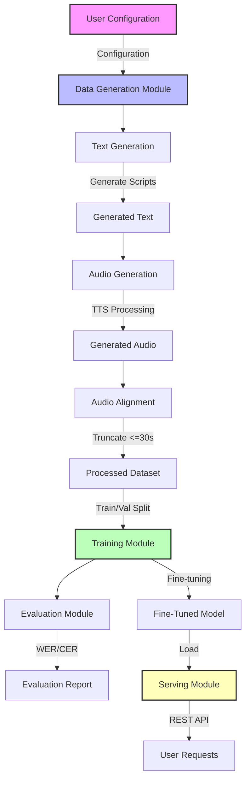

```mermaid
flowchart TD
    A[User Configuration] -->|Configuration| B[Data Generation Module]
    
    B --> C[Text Generation]
    C -->|Generate Scripts| D[Generated Text]
    
    D --> E[Audio Generation]
    E -->|TTS Processing| F[Generated Audio]
    
    F --> G[Audio Alignment]
    G -->|Truncate <=30s| H[Processed Dataset]
    
    H -->|Train/Val Split| I[Training Module]
    I -->|Fine-tuning| J[Fine-Tuned Model]
    
    I --> K[Evaluation Module]
    K -->|WER/CER| L[Evaluation Report]
    
    J -->|Load| M[Serving Module]
    M -->|REST API| N[User Requests]
    
    style A fill:#f9f,stroke:#333,stroke-width:2px
    style B fill:#bbf,stroke:#333,stroke-width:2px
    style I fill:#bfb,stroke:#333,stroke-width:2px
    style M fill:#ffb,stroke:#333,stroke-width:2px

```
